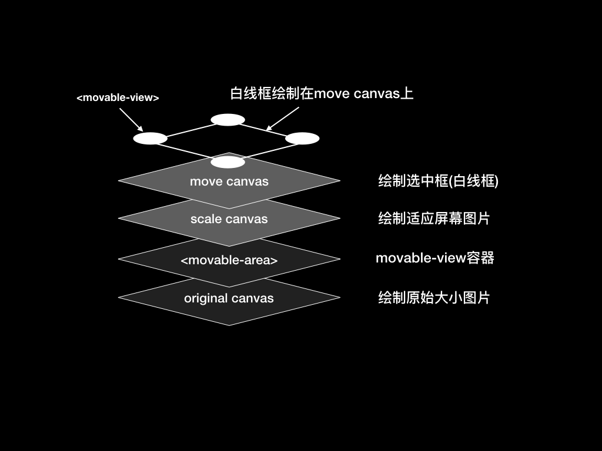

### welCropper 微信小程序截图工具


* 保证图片质量

#### Documents



因为`cropper`的数据和事件是直接绑定到`Page`上的，所以数据和事件命名应该避免一下名字（之后会想办法避免这种情况）及其相关解释：

data中的名字：

* cropperData
* cropperMovableItems

函数名：

* showCropper
* hideCropper
* cropImage
* getCropRect   
* loadImage
* adjustSize
* clearCanvas
* drawImage
* drawLines
* setupMoveItem
* moveEvent
* endEvent

外部只用到`showCropper`和`hideCropper`

```
/**
    inputPath:输入图片地址
    callback(resPath):点击“完成”按钮后毁掉函数，毁掉函数中会有截图地址
*/
showCropper(inputPath, callback)

```

#### 使用

将`welCropper`复制到自己的工程当中（以`/pages/index/index`为例）

##### `wxml`引入并调用：
```
<!-- 引入组件 -->
<import src="/welCropper/welCropper" />

<!-- 调用组件 -->
<template is="welCropper" data="{{data:cropperData, cropperMovableItems:cropperMovableItems}}"></template>

<!-- 用于选择图片，传入cropper中 -->
<button bindtap='selectTap'>select image</button>
```

##### `wxss`引入：
```
@import "/welCropper/welCropper.wxss";
```

##### `js`引入和使用：
```
// 获取显示区域长宽
const device = wx.getSystemInfoSync()
const W = device.windowWidth
const H = device.windowHeight - 50

let cropper = require('../../welCropper/welCropper.js');

console.log(device)

Page({
    data: {
    },
    onLoad: function () {
        var that = this
        // 初始化组件数据和绑定事件
        cropper.init.apply(that, [W, H]);
    },
    selectTap() {
        var that = this

        wx.chooseImage({
            count: 1, // 默认9
            sizeType: ['original', 'compressed'], // 可以指定是原图还是压缩图，默认二者都有
            sourceType: ['album', 'camera'], // 可以指定来源是相册还是相机，默认二者都有
            success(res) {
                const tempFilePath = res.tempFilePaths[0]
                console.log(tempFilePath)

                // 将选取图片传入cropper，并显示cropper
                that.showCropper(tempFilePath, (resPath) => {
                    console.log("crop callback:" + resPath)
                    wx.previewImage({
                        current: '',
                        urls: [resPath]
                    })

                    // that.hideCropper() //隐藏，我在项目里是点击完成就上传，所以如果回调是上传，那么隐藏掉就行了，不用previewImage
                })
            }
        })
    }
})
```